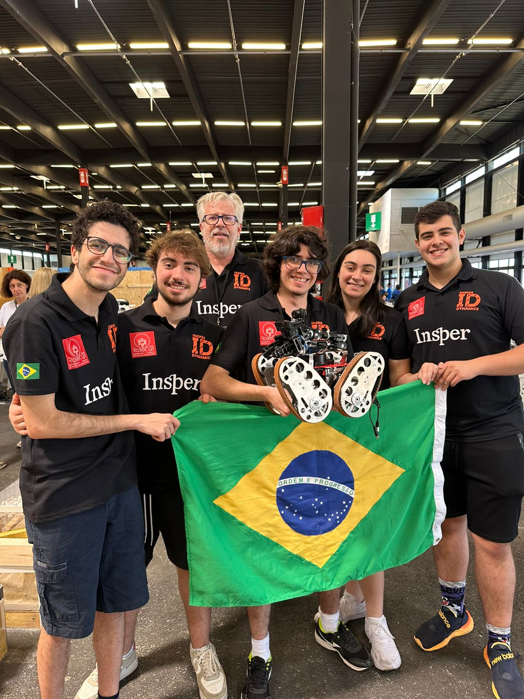

<h1 align="center"> Welcome to my Profile :alien: </h1>

<h2>I'm Eduardo Vaz!</h2>

- I'm 21 years old

- I'm from Paraná, Brazil 🇧🇷 but I live in São Paulo

- I graduated in Computer Science at [Insper](https://www.insper.edu.br/)

- I am a Software Engineer at [PrairieLearn](https://github.com/PrairieLearn/PrairieLearn)

<h1> About My Projects and Skills 🖥️</h1>

My profile mainly contains personal projects, many of which I've developed with my friends

Some interesting Projects to get started in knowing more about my skills are:

<h2> RoboCup 2023: Bordeaux</h2>

In the 2023 [RoboCup](https://www.robocup.org/) I was a pilot for [Insper Dynamics](https://www.linkedin.com/company/insper-dynamics/?viewAsMember=true), in the Rescue RMRC category, where we represented Insper and Brazil 🇧🇷.

